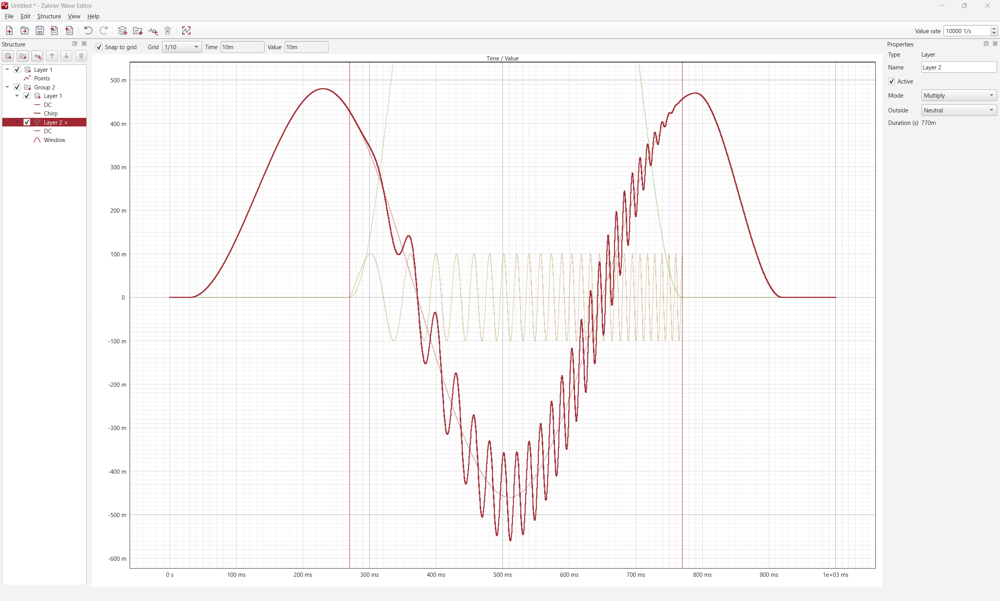

# Zahner Wave Editor

[](LICENSE)
[](#-building-from-source)
[](https://www.qt.io/)
[](https://en.cppreference.com/w/cpp/20)

The Zahner Wave Editor is a **free and open source graphical editor for arbitrary
waveforms**. You assemble a signal from layers and time-ordered segments - sine,
chirp, pulse, ramp, Ricker wavelet, a freely typed formula, or hand-drawn points -
watch the combined curve in a live plot, and export it as sampled values.



It was written to create custom excitation signals for the Zahner
[IM7/c/x](https://zahner.de/products-details/potentiostats/im7x) Electrochemical
Workstations, where an arbitrary curve is played back by the
[`WaveFileJob`](https://doc.zahner.de/im7/apis/zahner_link/python/pages/meas.html#zahner_link.meas.WaveFileJob)
of the [zahner_link](https://github.com/Zahner-elektrik/zahner_link) library. But
nothing in the editor is bound to that use case: it reads and writes **plain CSV**,
so the same waveforms drive any function generator, simulation, test bench or data
pipeline that consumes a sampled curve.

We open sourced it because a flexible waveform editor is useful far beyond our own
instruments. Most tools in this space are tied to one vendor's hardware or to a
fixed set of primitives, so we built one that composes signals freely and writes an
open format - and there is no reason to keep that to ourselves.

## ✨ Features

- **Layers and segments** - build a signal from time-ordered segments and stack
  several layers, each one **added or multiplied** into the layers above it
- **Layer groups** - a group combines its own layers first and takes the result
  into its level, so `A + (B × envelope)` is one structure rather than a
  workaround
- **Per-layer edge policy** - what a layer contributes beyond its own duration:
  neutral (0 when adding, 1 when multiplying), zero, hold last, or loop
- **Twelve segment generators** - DC, ramp, sine, square (duty cycle), triangle
  (symmetry), pulse, exponential, chirp (linear or exponential sweep), Ricker
  wavelet, formula, point lists, and windows
- **Window segments** - rectangular, Hann, Hamming, Blackman, Blackman-Harris,
  Tukey, Gauss, Kaiser and trapezoid, with amplitude and offset: everything
  from a fade-in to a gated burst or amplitude modulation
- **Formula segments** - type an expression in `t` and it is compiled and plotted
  as you type, powered by [muParser](https://beltoforion.de/en/muparser/)
- **Hand-drawn point segments** - with linear, step, or PCHIP interpolation
- **Repeats per segment** - a single sine segment can stand for 10 000 periods
  without duplicating anything
- **Direct manipulation** - drag points and segment boundaries in the plot, pan
  and zoom with the mouse, read time/value under the cursor
- **Spectrum (FFT) and statistics** - a second plot below the waveform shows the
  amplitude spectrum of the whole document, with selectable sample rate, window
  (rectangular, Hann, flat top, Blackman-Harris) and logarithmic axes; next to it
  DC, RMS, peak, crest factor, slew rate, fundamental, THD and a warning when the
  sample rate is too low - calculated in the background and following every edit
- **CSV import and export** - round-trip measured or externally generated curves
- **Binary export** - raw little-endian `double` values, the exact byte stream
  the `zahner_link` Python library uploads as a WAVE resource, so no conversion
  step of your own (Zahner Lab reads the CSV export instead)
- **Full undo/redo**, recent files, drag & drop of documents onto the window
- **Native document format** `.zwj` - human-readable, diffable JSON
- **Engineering notation everywhere** - type `1m`, `10k`, `2.5µ` into any numeric field
- **Light and dark theme**, English and German user interface - both in
  **Edit > Settings**, which follows the system language until you pick one
- **Cross-platform** - one Qt 6 code base for Windows, Linux and macOS
- **No telemetry, no account, no cloud** - a local desktop tool that reads and
  writes files

## 🎯 Waveforms for the Zahner IM7

The IM7 plays back an arbitrary curve with the
[`WaveJob`](https://doc.zahner.de/im7/apis/zahner_link/python/pages/meas.html#zahner_link.meas.WaveJob)
and
[`WaveFileJob`](https://doc.zahner.de/im7/apis/zahner_link/python/pages/meas.html#zahner_link.meas.WaveFileJob)
of `zahner_link`, potentiostatically or galvanostatically - one value per tick,
which is exactly the list of numbers the Wave Editor produces.

The editor samples your waveform at a constant **Value Rate**, the `1/s` field in
the toolbar. The export contains those values only, so the rate is what gives them
their time axis: sample *i* is the value at *t = i / Value Rate*. Pass the same rate
as `value_rate` to the job and the curve plays back exactly as designed. The export
dialog can override the rate for a single export, in which case the override is the
one to use.

`WaveJob` takes the values inline, which is the simplest route for short signals.
`WaveFileJob` is the variant for **large** waveforms: the samples are uploaded once
as a device resource of little-endian `double` values and the job only references
its id, which is the recommended path for anything longer than a few thousand
points. Both take `value_rate`, so exporting the values and passing the rate they
were exported with is all there is to it.

### Binary export - straight into a `zahner_link` WAVE resource

Pick **Binary** in the export dialog and the file *is* the resource payload: raw
little-endian IEEE-754 `double` values, 8 bytes each, no header. That is byte for
byte what `struct.pack("<d", value)` produces, so there is nothing left to convert
in Python - hand the path to `create_resource_from_file`:

```python
resource = link.create_resource_from_file(
    zl.ResourceTypeEnum.WAVE, "wave.bin", "wave_from_editor"
)

wave_job = zl.meas.WaveFileJob(
    output_data_rate=rate,
    value_rate=rate,      # the Value Rate the file was exported with
    repetitions=1,
    current_range=0.001,
    resource_id=resource.get_id(),
)
link.do_job(wave_job)
```

The binary export exists for this Python path only. **Zahner Lab reads the CSV
export, not the binary one** - see below.

The
[ArbitrarySignal](https://github.com/Zahner-elektrik/zahner_link/blob/main/python/ArbitrarySignal/ArbitrarySignal.ipynb)
notebook in the `zahner_link` repository is a complete, runnable walkthrough of
both job types.

### Without writing any code

In [Zahner Lab](https://zahner.de/de/products-details/software/zahner-lab), the
[Custom Waveform](https://doc.zahner.de/im7/zahner_lab/custom_experiment_builder/primitives/dynamic.html#wave-custom-waveform) block of the [Custom Experiment Builder](https://doc.zahner.de/im7/zahner_lab/custom_experiment_builder/index.html) reads the exported CSV
directly. **Export as CSV for this path** - the Custom Waveform block wants the
text values; the binary export is for the `zahner_link` resource upload above.
The Wave Editor ships as an optional component of the Zahner Lab installer for
exactly this workflow.

## 🌊 Use it with anything else

Both exports are deliberately boring, so they fit everywhere. **CSV** is one
sample per line:

```
0.000000000
0.062790520
0.125333234
...
```

UTF-8 without BOM, Unix line endings, `.` as the decimal separator regardless of
your system locale, one sample per line at a constant rate, up to 9 significant
digits (configurable). No header, no units, no metadata - feed it to NumPy,
MATLAB, a SCPI `DATA:DAC` upload, an FPGA lookup table, or a unit test fixture.

**Binary** is the same sequence as raw little-endian IEEE-754 `double` values, 8
bytes per sample, nothing else in the file - so its size is always `8 × samples`.
It costs no precision and about a third of the bytes, which matters once a
waveform runs into the millions of samples. Every toolchain reads it in one line:

| | |
|---|---|
| NumPy | `np.fromfile("wave.bin", dtype="<f8")` |
| Python | `array.array("d")` + `fromfile`, or `struct.iter_unpack("<d", data)` |
| MATLAB | `fread(fopen("wave.bin"), inf, "float64", 0, "ieee-le")` |
| C/C++ | `fread()` straight into a `double[]` on any little-endian target |

Neither format stores the value rate - sample *i* is the value at *t = i / rate* -
so keep the rate the export was made with.

Import accepts a superset of that format, so curves from other tools come back in:

| Input | Interpretation |
|---|---|
| One column | values at `t = i / rate`, with the rate you choose on import |
| Two columns (`,` or `;`) | `(time, value)` pairs, time shifted so the first point is `0` |
| A first row of two non-numeric fields | treated as a header and skipped |

Point times have to be strictly increasing and at least two points must remain.
Everything else is rejected, naming the offending line: a third column, mixed
separators in one row, an empty row, an unparseable or non-finite number. Only the
two-column form recognizes a header row - in a single-column file, a leading text
line is an error.

On import you pick linear, step or PCHIP interpolation, and whether the curve goes
into a new layer or is appended to the end of the selected one. Either way it
becomes an ordinary point segment afterwards: drag its points in the plot, scale it,
or add a generated signal in a second layer to superimpose on it.

## 📦 Installation

Standalone installers for Windows, Linux and macOS are attached to the
[releases](https://github.com/Zahner-elektrik/zahner_wave_editor/releases). They
bundle the required Qt runtime, so there is nothing else to install.

The editor is also available as the optional `ZahnerLab.WaveEditor` component in
the [Zahner Lab](https://zahner.de/de/products-details/software/zahner-lab)
installer.

## 🔨 Building from source

```bash
git clone https://github.com/Zahner-elektrik/zahner_wave_editor.git
cd zahner_wave_editor
cmake -S . -B build -G Ninja
cmake --build build
ctest --test-dir build --output-on-failure
./build/src/app/ZahnerWaveEditor            # optionally: <file.zwj>
```

**Requirements:** CMake ≥ 3.20, Qt ≥ 6.4 (Core, Gui, Widgets, LinguistTools,
Test), a C++20 compiler. muParser is vendored in `third_party/`, so there is no
other dependency to resolve.

<details>
<summary>Building the standalone installer</summary>

The Qt Installer Framework package is configured when `binarycreator` is found
through `CPACK_IFW_ROOT`, `QTIFW_ROOT`, `QTIFWDIR`, `PATH`, or a standard
`~/Qt/Tools/QtInstallerFramework/*` / `~/Qt/QtIFW-*` installation.

```bash
cmake -S . -B build -G Ninja -DZWE_BUILD_INSTALLER=ON -DCPACK_IFW_ROOT=/path/to/QtInstallerFramework
cmake --build build
cmake --build build --target package
```

</details>

## 🗂️ Repository layout

| Path | Content |
|---|---|
| `src/core/` | `wavecore` - data model, sampling, expressions, `.zwj`/CSV IO (Qt6::Core only, fully unit-tested) |
| `src/ui/` | `waveui` - main window, plot canvas, docks, dialogs |
| `src/app/` | the `ZahnerWaveEditor` executable (a thin shell around `waveui`) |
| `tests/` | QtTest unit and widget tests, run through `ctest` |
| `resources/` | icons, the built-in help pages, third-party license texts |
| `translations/` | Qt Linguist `.ts` files (currently German) |
| `third_party/` | vendored dependencies (muParser 2.3.5, BSD-2-Clause) |

The core library deliberately depends on `Qt6::Core` only. Sampling, the `.zwj`
reader/writer, the expression parser and the CSV contract are therefore testable
- and reusable - without a GUI.

## 🤝 Contributing

Pull requests are welcome. Please read [CONTRIBUTING.md](CONTRIBUTING.md) first -
it covers the code style (`.clang-format`), the test expectations, and the
**contribution licensing terms**, which you need to agree to for your
contribution to be merged.

Good first areas: additional segment generators, further export formats, more UI
translations, and platform packaging.

## 📧 Having a question?

Send a [mail](mailto:support@zahner.de?subject=Zahner%20Wave%20Editor%20Question&body=Your%20Message)
to our support team.

## ⁉️ Found a bug or missing a specific feature?

Feel free to **create a new issue** with an appropriate title and description in
the [zahner_wave_editor repository issue tracker](https://github.com/Zahner-elektrik/zahner_wave_editor/issues).
Or send a [mail](mailto:support@zahner.de?subject=Zahner%20Wave%20Editor%20Question&body=Your%20Message)
to our support team.

## ⚖️ License

The Zahner Wave Editor is **free software, licensed under the
[GNU General Public License, version 3](LICENSE)**.

```
Copyright (C) 2026 Zahner-Elektrik GmbH & Co. KG

This program is free software: you can redistribute it and/or modify it under
the terms of the GNU General Public License, version 3, as published by the
Free Software Foundation.

This program is distributed in the hope that it will be useful, but WITHOUT ANY
WARRANTY; without even the implied warranty of MERCHANTABILITY or FITNESS FOR A
PARTICULAR PURPOSE. See the GNU General Public License for more details.
```

### Dual licensing

This project is **dual licensed**. Zahner-Elektrik is the sole copyright holder
and, in addition to the GPLv3 grant above, also distributes the Wave Editor as a
component of its proprietary products - notably Zahner Lab - under the
[Zahner Software License](https://github.com/Zahner-elektrik/zahner_link/blob/main/LICENSE).
Which license applies to your copy depends on where you got it from:

| You obtained it from | Your license |
|---|---|
| This repository or a GitHub release | GNU GPL v3 |
| The Zahner Lab installer | Zahner Software License / the Zahner Lab EULA |

Being the copyright holder, Zahner-Elektrik may license the same code under both
sets of terms; the GPLv3 grant to you is unconditional and permanent, and nothing
here restricts the rights the GPL gives you. This is the reason contributions
require the licensing agreement described in
[CONTRIBUTING.md](CONTRIBUTING.md): without it, contributed code could not be
shipped in Zahner Lab, and the two distributions would drift apart.

`SPDX-License-Identifier: GPL-3.0-only`

### Third-party components

| Component | License |
|---|---|
| [Qt 6](https://www.qt.io/) | LGPL-3.0 (dynamically linked) |
| [muParser 2.3.5](https://github.com/beltoforion/muparser) | BSD-2-Clause, vendored in `third_party/muparser/` |

The full texts are in `resources/licenses/` and `third_party/muparser/LICENSE`,
and are also viewable in the application under **Help → Open Source Licenses**.
